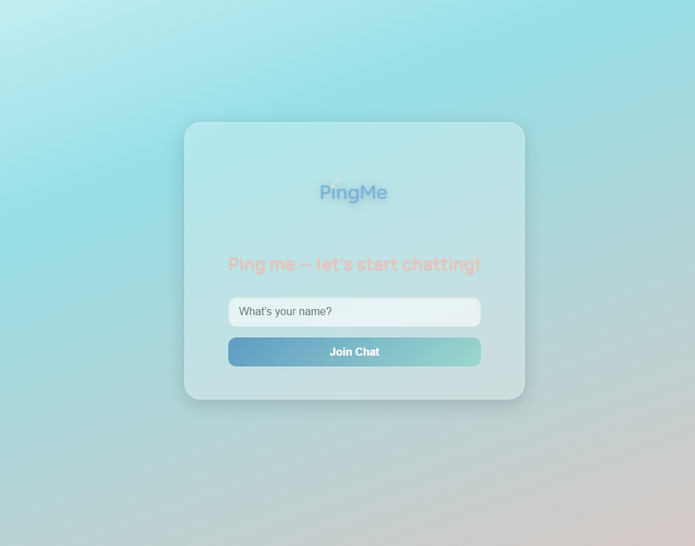
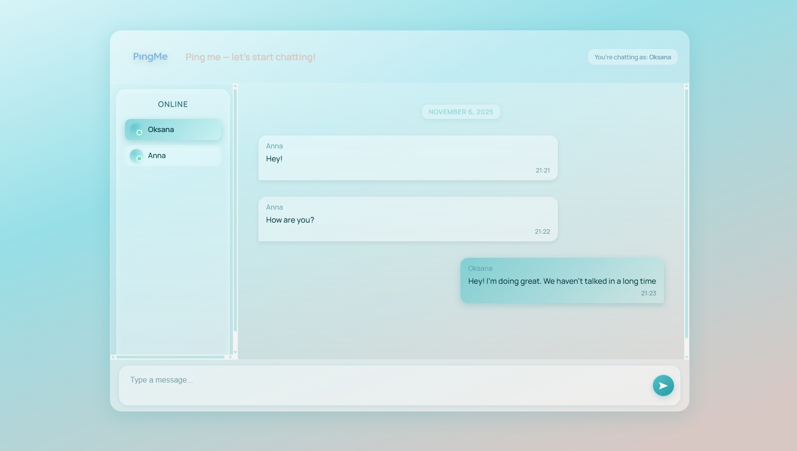

#  Ping Me — Let's Start Chatting!


>  **Современный веб-чат с реальным временем и стильным интерфейсом.**  
> Создан с использованием **React + TypeScript + Socket.IO**.  
> Проект демонстрирует как визуальную эстетику, так и техническую сторону веб-разработки.

---

##  О проекте

**Ping Me** — это креативное приложение для общения, разработанное в минималистичном стиле с элементами стеклянного и глянцевого дизайна.  
Пользователи могут:
- Присоединиться к чату, указав своё имя  
- В реальном времени обмениваться сообщениями  
- Видеть, кто онлайн  
- Наслаждаться современной визуальной атмосферой с мягкими градиентами и плавной анимацией  

---

##  Скриншоты

###  Стартовая страница


###  Основное окно чата


---

##  Основные возможности

✅ **Реальное время** — обмен сообщениями через Socket.IO  
✅ **Онлайн-список** — показывает активных пользователей  
✅ **Плавная прокрутка** — автофокус на новых сообщениях  
✅ **Кастомный дизайн скроллбара** — в стиле стеклянного интерфейса  
✅ **Интуитивный UI** — современный, лёгкий и воздушный стиль  
✅ **Удобная структура кода** — легко масштабировать и модифицировать  

---

##  Используемые технологии

| Категория | Технологии |
|------------|-------------|
| **Frontend** | React, TypeScript, CSS Modules |
| **Backend** | Node.js, Express, Socket.IO |
| **UI / UX** | Glassmorphism, адаптивный дизайн, плавные переходы |


---

## Установка и запуск:

###  Клонировать репозиторий
```
  git clone https://github.com/<your-username>/ping-me-chat.git
```
##  Сервер

### 1. Перейдите в папку server

### 2. Установите зависимости:

```
  npm install
```
### 2. Запустите сервер:

```
  node server.js
```
##  Клиент (React)

### 1. Перейдите в папку react

### 2. Установите зависимости:

```
  npm install
```
### Запустите приложение:

```
  npm run dev
```
---

##  Автор

**Oksana Otroshevska — Front-End Developer & Designer**
> - Более 10 лет опыта в графическом дизайне.
> - В настоящее время развиваюсь в веб-разработке (React, TypeScript, UI/UX).
> - Цель — создавать визуально привлекательные и функциональные цифровые продукты.

